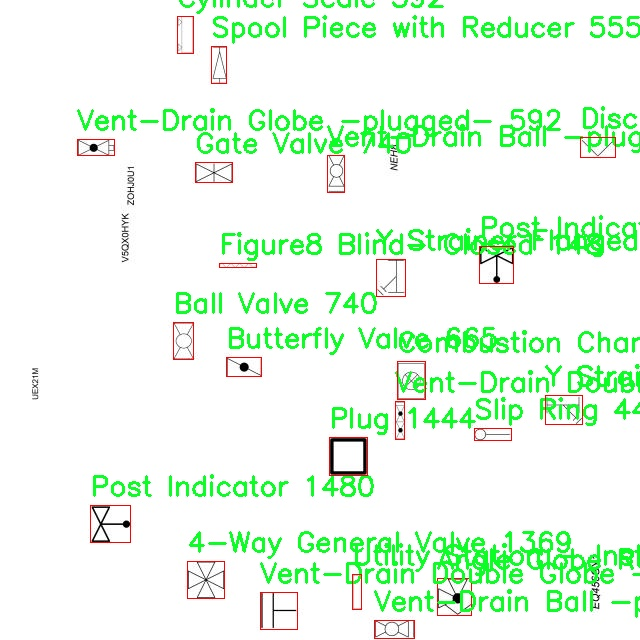

# 工业阀门类型检测系统源码分享
 # [一条龙教学YOLOV8标注好的数据集一键训练_70+全套改进创新点发刊_Web前端展示]

### 1.研究背景与意义

项目参考[AAAI Association for the Advancement of Artificial Intelligence](https://gitee.com/qunmasj/projects)

研究背景与意义

在现代工业生产中，阀门作为控制流体流动的重要组件，广泛应用于石油、化工、电力等多个领域。随着工业自动化程度的提高，阀门的种类和数量也在不断增加，导致对阀门的管理和维护提出了更高的要求。传统的阀门检测方法往往依赖人工识别和经验判断，效率低下且容易出错。因此，基于计算机视觉和深度学习技术的自动化阀门检测系统应运而生，成为提升工业生产效率和安全性的重要手段。

YOLO（You Only Look Once）系列模型因其快速和高效的目标检测能力而受到广泛关注。YOLOv8作为该系列的最新版本，结合了更为先进的网络结构和训练策略，能够在保证检测精度的同时大幅提升检测速度。然而，面对工业阀门这一复杂的检测任务，YOLOv8在特定应用场景下仍然存在一定的局限性，如对小目标的检测能力不足、对不同种类阀门的识别准确率有待提高等。因此，改进YOLOv8以适应工业阀门类型检测的需求，具有重要的研究价值和实际意义。

本研究将基于现有的YOLOv8模型，结合工业阀门的特征和实际应用场景，对模型进行改进和优化。具体而言，研究将采用一个包含9909张图像和222个类别的阀门数据集，涵盖了多种类型的阀门，如球阀、蝶阀、闸阀等。这一丰富的数据集为模型的训练和验证提供了坚实的基础，使得研究能够充分考虑不同阀门的形状、结构和功能特征，从而提升模型的识别能力。

通过对YOLOv8的改进，本研究旨在实现高效、准确的工业阀门类型检测系统，能够在实际应用中快速识别和分类不同类型的阀门。这不仅能够减少人工检测的工作量，提高工作效率，还能降低因识别错误导致的安全隐患，确保工业生产的顺利进行。此外，研究成果还将为其他工业设备的自动检测提供参考，推动智能制造和工业4.0的发展。

综上所述，基于改进YOLOv8的工业阀门类型检测系统的研究，不仅具有重要的理论意义，还具备广泛的应用前景。通过深入探讨和解决现有技术中的不足，研究将为工业自动化领域的智能化发展贡献新的思路和方法。

### 2.图片演示


##### 注意：由于此博客编辑较早，上面“2.图片演示”和“3.视频演示”展示的系统图片或者视频可能为老版本，新版本在老版本的基础上升级如下：（实际效果以升级的新版本为准）

  （1）适配了YOLOV8的“目标检测”模型和“实例分割”模型，通过加载相应的权重（.pt）文件即可自适应加载模型。

  （2）支持“图片识别”、“视频识别”、“摄像头实时识别”三种识别模式。

  （3）支持“图片识别”、“视频识别”、“摄像头实时识别”三种识别结果保存导出，解决手动导出（容易卡顿出现爆内存）存在的问题，识别完自动保存结果并导出到。

  （4）支持Web前端系统中的标题、背景图等自定义修改，后面提供修改教程。

  另外本项目提供训练的数据集和训练教程,暂不提供权重文件（best.pt）,需要您按照教程进行训练后实现图片演示和Web前端界面演示的效果。

### 3.视频演示

[3.1 视频演示](https://www.bilibili.com/video/BV1YnWBejEai/?vd_source=ff015de2d29cbe2a9cdbfa7064407a08)

### 4.数据集信息展示

数据集信息展示

本数据集旨在为改进YOLOv8的工业阀门类型检测系统提供丰富的训练数据，包含了9909张高质量的图像，涵盖了222个不同的类别。这些类别包括多种类型的阀门和相关设备，反映了工业领域中广泛使用的阀门种类，具有重要的应用价值和研究意义。数据集的多样性不仅能够帮助模型更好地理解和识别不同类型的阀门，还能提高其在实际应用中的准确性和鲁棒性。

在类别列表中，涵盖了从常见的3-Way Ball Valve到复杂的Alfa Laval Heat Exchanger等多种阀门类型。每个类别的设计都经过精心挑选，确保数据集的代表性。例如，3-Way General Regulating Valve和4-Way Globe Valve等类别，不仅在工业应用中占据重要地位，而且在流体控制和调节方面发挥着关键作用。此外，数据集中还包括了各种特殊设计的阀门，如带有压力释放孔的Ball Valve和不同类型的Demister，这些都为模型的训练提供了丰富的特征和变异性。

该数据集的图像数量和类别数量的组合，使其成为一个极具挑战性和实用性的资源。每个类别都代表了特定的工业应用场景，能够帮助模型学习到不同阀门的外观特征、结构细节以及功能特性。通过这些数据，YOLOv8模型可以在识别和分类工业阀门时，获得更高的准确率和更快的处理速度，进而提升工业自动化和智能化水平。

此外，数据集的使用遵循CC BY 4.0许可证，意味着用户可以自由地使用、修改和分发数据集，只需给予适当的署名。这一开放的许可政策鼓励了研究人员和开发者在工业阀门检测领域的进一步探索和创新，推动了相关技术的进步。

总之，本数据集不仅是YOLOv8模型训练的基础，也是推动工业阀门类型检测技术发展的重要资源。通过对多样化的阀门类别进行系统化的学习，模型将能够在实际应用中实现更高的智能化水平，为工业生产和管理提供更为精准的技术支持。随着数据集的不断扩展和优化，未来的工业阀门检测系统将能够应对更复杂的场景，满足日益增长的市场需求。





### 5.全套项目环境部署视频教程（零基础手把手教学）

[5.1 环境部署教程链接（零基础手把手教学）](https://www.ixigua.com/7404473917358506534?logTag=c807d0cbc21c0ef59de5)


[5.2 安装Python虚拟环境创建和依赖库安装视频教程链接（零基础手把手教学）](https://www.ixigua.com/7404474678003106304?logTag=1f1041108cd1f708b01a)

### 6.手把手YOLOV8训练视频教程（零基础小白有手就能学会）

[6.1 环境部署教程链接（零基础手把手教学）](https://www.ixigua.com/7404477157818401292?logTag=d31a2dfd1983c9668658)

### 7.70+种全套YOLOV8创新点代码加载调参视频教程（一键加载写好的改进模型的配置文件）

[7.1 环境部署教程链接（零基础手把手教学）](https://www.ixigua.com/7404478314661806627?logTag=29066f8288e3f4eea3a4)

### 8.70+种全套YOLOV8创新点原理讲解（非科班也可以轻松写刊发刊，V10版本正在科研待更新）

由于篇幅限制，每个创新点的具体原理讲解就不一一展开，具体见下列网址中的创新点对应子项目的技术原理博客网址【Blog】：


[8.1 70+种全套YOLOV8创新点原理讲解链接](https://gitee.com/qunmasj/good)

### 9.系统功能展示（检测对象为举例，实际内容以本项目数据集为准）

图1.系统支持检测结果表格显示

  图2.系统支持置信度和IOU阈值手动调节

  图3.系统支持自定义加载权重文件best.pt(需要你通过步骤5中训练获得)

  图4.系统支持摄像头实时识别

  图5.系统支持图片识别

  图6.系统支持视频识别

  图7.系统支持识别结果文件自动保存

  图8.系统支持Excel导出检测结果数据


### 10.原始YOLOV8算法原理

原始YOLOv8算法原理

YOLOv8算法作为目标检测领域的最新进展，继承并扩展了YOLO系列模型的优良传统，致力于在速度和准确性之间找到最佳平衡。其设计理念围绕着高效的特征提取和精准的目标检测展开，力求在复杂的视觉任务中提供卓越的性能。YOLOv8的结构主要由三个核心部分组成：Backbone、Neck和Head，这三部分协同工作，共同实现对输入图像的深度解析和目标识别。

在Backbone部分，YOLOv8采用了CSPDarknet结构，这是一个经过精心设计的网络架构，旨在提高特征提取的效率和准确性。CSPDarknet通过将网络分为两个部分，每个部分都包含多个残差块，从而实现更为丰富的特征学习。与前代YOLOv5相比，YOLOv8引入了C2f模块替代了C3模块，C2f模块的设计理念在于将输入特征图分为两个分支，每个分支通过卷积层进行降维处理。这种结构不仅提高了特征图的维度，还通过堆叠多个分支，增强了模型的梯度流信息，使得特征提取更加高效。

此外，YOLOv8还引入了v8_C2fBottleneck层，这一层的设计使得每个输出分支都能进一步增强特征的表达能力。通过这种创新的设计，YOLOv8能够在保持较低计算量的同时，提取出更为复杂和丰富的特征信息。这种特征提取的能力在实际应用中表现得尤为突出，尤其是在面对复杂背景和多样化目标时，YOLOv8能够更好地识别和定位目标。

在特征提取之后，YOLOv8的Neck部分采用了快速空间金字塔池化（SPPF）结构，这一结构的引入极大地提升了模型对不同尺度特征的提取能力。SPPF通过多个最大池化层的组合，能够有效地处理多尺度特征，从而增强网络的特征抽象能力。这一过程不仅减少了模型的参数量和计算量，还提高了特征提取的效率，使得YOLOv8在面对各种复杂场景时都能保持高效的性能。

目标检测部分则采用了特征金字塔网络（FPN）和路径聚合网络（PAN）的组合结构。这一结构通过多个卷积层和池化层的协同作用，对特征图进行处理和压缩，确保了不同尺度特征的有效融合。通过这种方式，YOLOv8能够在多层次上捕捉到目标的特征信息，从而提升检测的准确性。

YOLOv8的另一大创新在于其无锚框（Anchor-Free）的检测方式。传统的目标检测方法往往依赖于预定义的锚框，这在某些情况下可能导致检测效果不佳。而YOLOv8通过直接预测目标的中心点和宽高比例，省去了锚框的设定，简化了检测过程。这种方式不仅提高了检测速度，还显著提升了检测的准确度，使得YOLOv8在实际应用中表现得更加灵活和高效。

最后，YOLOv8的Head部分采用了解耦的检测头结构，通过两个并行的卷积分支分别计算回归和类别的损失。这一设计使得模型在处理目标检测任务时能够更加精准地进行分类和定位，从而提升整体的检测性能。结合全新的损失函数CloU，YOLOv8在目标检测的准确性和效率上达到了新的高度。

总的来说，YOLOv8算法通过引入一系列创新的结构和方法，极大地提升了目标检测的性能。其高效的特征提取机制、灵活的无锚框检测方式以及精确的损失计算，使得YOLOv8在目标检测领域中占据了重要的地位。随着YOLOv8的不断发展和应用，其在智能监控、自动驾驶、无人机视觉等多个领域的潜力将得到进一步的挖掘和发挥。


### 11.项目核心源码讲解（再也不用担心看不懂代码逻辑）

#### 11.1 ui.py

以下是经过简化和注释的核心代码部分：

```python
import sys
import subprocess

def run_script(script_path):
    """
    使用当前 Python 环境运行指定的脚本。

    Args:
        script_path (str): 要运行的脚本路径
    """
    # 获取当前 Python 解释器的路径
    python_path = sys.executable

    # 构建运行命令，使用 streamlit 运行指定的脚本
    command = f'"{python_path}" -m streamlit run "{script_path}"'

    # 执行命令，并检查返回结果
    result = subprocess.run(command, shell=True)
    if result.returncode != 0:
        print("脚本运行出错。")

# 主程序入口
if __name__ == "__main__":
    # 指定要运行的脚本路径
    script_path = "web.py"  # 假设脚本在当前目录下

    # 调用函数运行脚本
    run_script(script_path)
```

### 代码说明：
1. **导入模块**：
   - `sys`：用于获取当前 Python 解释器的路径。
   - `subprocess`：用于执行外部命令。

2. **`run_script` 函数**：
   - 接受一个参数 `script_path`，表示要运行的 Python 脚本的路径。
   - 使用 `sys.executable` 获取当前 Python 解释器的路径。
   - 构建一个命令字符串，使用 `streamlit` 运行指定的脚本。
   - 使用 `subprocess.run` 执行构建的命令，并检查返回码。如果返回码不为 0，表示脚本运行出错，打印错误信息。

3. **主程序入口**：
   - 当脚本作为主程序运行时，指定要运行的脚本路径（这里假设为 "web.py"）。
   - 调用 `run_script` 函数来执行指定的脚本。

这个文件是一个 Python 脚本，主要功能是运行一个名为 `web.py` 的脚本，使用的是当前 Python 环境中的 Streamlit 库。首先，脚本通过导入必要的模块来实现其功能，包括 `sys`、`os` 和 `subprocess`，以及一个自定义的 `abs_path` 函数用于获取绝对路径。

在 `run_script` 函数中，首先获取当前 Python 解释器的路径，接着构建一个命令字符串，该命令用于调用 Streamlit 来运行指定的脚本。具体来说，命令的格式是 `python -m streamlit run "script_path"`，其中 `script_path` 是要运行的脚本的路径。随后，使用 `subprocess.run` 方法执行这个命令，并通过 `shell=True` 参数允许在 shell 中执行。

如果脚本运行过程中出现错误，`result.returncode` 将不等于 0，此时会打印出“脚本运行出错。”的提示信息。

在脚本的最后部分，使用 `if __name__ == "__main__":` 来确保只有在直接运行该脚本时才会执行后面的代码。这里指定了要运行的脚本路径为 `web.py`，并调用 `run_script` 函数来执行它。

总体来说，这个脚本的主要目的是为用户提供一个简单的接口来运行 Streamlit 应用，确保可以在当前 Python 环境中顺利执行指定的脚本。

#### 11.2 ultralytics\models\sam\modules\encoders.py

以下是经过简化和注释的核心代码部分，主要包括 `ImageEncoderViT` 和 `PatchEmbed` 类的实现，以及它们的关键功能。

```python
import torch
import torch.nn as nn
from typing import Optional, Tuple, Type

class PatchEmbed(nn.Module):
    """将图像划分为补丁并进行嵌入的模块。"""

    def __init__(
        self,
        kernel_size: Tuple[int, int] = (16, 16),  # 卷积核大小
        stride: Tuple[int, int] = (16, 16),       # 步幅
        in_chans: int = 3,                        # 输入图像通道数
        embed_dim: int = 768,                     # 嵌入维度
    ) -> None:
        super().__init__()
        # 使用卷积层将图像补丁嵌入到指定的维度
        self.proj = nn.Conv2d(in_chans, embed_dim, kernel_size=kernel_size, stride=stride)

    def forward(self, x: torch.Tensor) -> torch.Tensor:
        """计算补丁嵌入，输出形状为 [B, H, W, C]。"""
        return self.proj(x).permute(0, 2, 3, 1)  # 将输出从 [B, C, H, W] 转换为 [B, H, W, C]


class ImageEncoderViT(nn.Module):
    """
    使用视觉变换器（ViT）架构对图像进行编码的模块。
    将图像划分为补丁，并通过一系列变换块处理这些补丁。
    """

    def __init__(
        self,
        img_size: int = 1024,   # 输入图像大小
        patch_size: int = 16,    # 补丁大小
        in_chans: int = 3,       # 输入图像通道数
        embed_dim: int = 768,    # 嵌入维度
        depth: int = 12,         # ViT 的深度
        num_heads: int = 12,     # 每个 ViT 块的注意力头数
        out_chans: int = 256,    # 输出通道数
    ) -> None:
        super().__init__()
        self.img_size = img_size

        # 初始化补丁嵌入模块
        self.patch_embed = PatchEmbed(
            kernel_size=(patch_size, patch_size),
            stride=(patch_size, patch_size),
            in_chans=in_chans,
            embed_dim=embed_dim,
        )

        # 初始化变换块
        self.blocks = nn.ModuleList()
        for _ in range(depth):
            block = Block(
                dim=embed_dim,
                num_heads=num_heads,
            )
            self.blocks.append(block)

        # 颈部模块，用于进一步处理输出
        self.neck = nn.Sequential(
            nn.Conv2d(embed_dim, out_chans, kernel_size=1, bias=False),
            nn.LayerNorm(out_chans),
            nn.Conv2d(out_chans, out_chans, kernel_size=3, padding=1, bias=False),
            nn.LayerNorm(out_chans),
        )

    def forward(self, x: torch.Tensor) -> torch.Tensor:
        """通过补丁嵌入、变换块和颈部模块处理输入。"""
        x = self.patch_embed(x)  # 进行补丁嵌入
        for blk in self.blocks:   # 逐个通过变换块
            x = blk(x)
        return self.neck(x.permute(0, 3, 1, 2))  # 通过颈部模块并调整维度
```

### 代码说明：
1. **PatchEmbed 类**：
   - 该类负责将输入图像划分为多个补丁，并将这些补丁嵌入到一个高维空间中。使用卷积层来实现这一功能，输出的形状为 `[B, H, W, C]`，其中 `B` 是批量大小，`H` 和 `W` 是补丁的高度和宽度，`C` 是嵌入的维度。

2. **ImageEncoderViT 类**：
   - 该类实现了一个基于视觉变换器（ViT）的图像编码器。它首先将输入图像通过 `PatchEmbed` 进行补丁嵌入，然后通过多个变换块进行处理，最后通过一个颈部模块生成最终的编码表示。
   - `forward` 方法中，输入图像首先经过补丁嵌入，然后依次通过每个变换块，最后经过颈部模块得到输出。

这些代码是实现视觉变换器的核心部分，主要用于图像的特征提取和编码。

这个程序文件定义了一个用于图像编码的类 `ImageEncoderViT`，该类基于视觉变换器（Vision Transformer, ViT）架构，将输入图像编码为紧凑的潜在空间。编码过程包括将图像分割成多个小块（patches），并通过一系列的变换块（transformer blocks）处理这些小块。最终，经过一个“颈部”模块（neck）生成最终的编码表示。

在 `ImageEncoderViT` 类的构造函数中，初始化了一些参数，包括输入图像的大小、每个小块的大小、输入通道数、嵌入维度、变换块的深度、注意力头的数量等。该类使用了一个 `PatchEmbed` 模块来实现小块嵌入，并根据需要初始化绝对位置嵌入。接着，构建了一系列的变换块，并将它们存储在一个模块列表中。最后，定义了一个颈部模块，进一步处理输出以生成最终的编码表示。

`forward` 方法负责将输入数据通过小块嵌入、位置嵌入、变换块和颈部模块进行处理，最终返回编码后的结果。

文件中还定义了一个 `PromptEncoder` 类，用于编码不同类型的提示，包括点、框和掩码，以便输入到 SAM 的掩码解码器。该类生成稀疏和密集的嵌入表示，包含了多个方法来处理不同类型的输入提示。构造函数中初始化了嵌入维度、输入图像大小、掩码输入通道数等参数，并构建了相应的嵌入层和下采样网络。

此外，文件中还定义了多个辅助类和函数，包括 `PositionEmbeddingRandom` 用于生成随机位置编码，`Block` 和 `Attention` 类实现了变换器块和多头注意力机制，`window_partition` 和 `window_unpartition` 函数用于实现窗口分区和反分区操作，`get_rel_pos` 和 `add_decomposed_rel_pos` 函数用于处理相对位置编码。

整体而言，这个文件实现了一个复杂的图像编码器，结合了视觉变换器的优点，能够有效地处理图像数据并生成有用的特征表示，适用于后续的任务如目标检测和图像分割等。

#### 11.3 ultralytics\models\rtdetr\model.py

```python
# Ultralytics YOLO 🚀, AGPL-3.0 license
"""
RT-DETR模型接口，基于视觉变换器的实时目标检测器。RT-DETR提供实时性能和高准确性，
在CUDA和TensorRT等加速后端表现优异。它具有高效的混合编码器和IoU感知查询选择，
以提高检测准确性。
"""

from ultralytics.engine.model import Model  # 导入基础模型类
from ultralytics.nn.tasks import RTDETRDetectionModel  # 导入RT-DETR检测模型类

from .predict import RTDETRPredictor  # 导入预测器
from .train import RTDETRTrainer  # 导入训练器
from .val import RTDETRValidator  # 导入验证器


class RTDETR(Model):
    """
    RT-DETR模型接口。该基于视觉变换器的目标检测器提供实时性能和高准确性。
    支持高效的混合编码、IoU感知查询选择和可调的推理速度。

    属性:
        model (str): 预训练模型的路径，默认为'rtdetr-l.pt'。
    """

    def __init__(self, model="rtdetr-l.pt") -> None:
        """
        使用给定的预训练模型文件初始化RT-DETR模型。支持.pt和.yaml格式。

        参数:
            model (str): 预训练模型的路径，默认为'rtdetr-l.pt'。

        异常:
            NotImplementedError: 如果模型文件扩展名不是'pt'、'yaml'或'yml'。
        """
        # 检查模型文件扩展名是否有效
        if model and model.split(".")[-1] not in ("pt", "yaml", "yml"):
            raise NotImplementedError("RT-DETR只支持从*.pt、*.yaml或*.yml文件创建。")
        # 调用父类构造函数，初始化模型
        super().__init__(model=model, task="detect")

    @property
    def task_map(self) -> dict:
        """
        返回RT-DETR的任务映射，将任务与相应的Ultralytics类关联。

        返回:
            dict: 一个字典，将任务名称映射到RT-DETR模型的Ultralytics任务类。
        """
        return {
            "detect": {
                "predictor": RTDETRPredictor,  # 预测器类
                "validator": RTDETRValidator,  # 验证器类
                "trainer": RTDETRTrainer,      # 训练器类
                "model": RTDETRDetectionModel,  # RT-DETR检测模型类
            }
        }
``` 

### 代码核心部分及注释说明
1. **类定义**: `RTDETR` 继承自 `Model`，是RT-DETR模型的接口。
2. **初始化方法**: `__init__` 方法用于初始化模型，检查模型文件的扩展名是否合法，并调用父类的构造函数。
3. **任务映射**: `task_map` 属性返回一个字典，映射不同的任务到相应的类，包括预测器、验证器、训练器和模型类。

这个程序文件是关于百度的RT-DETR模型的接口实现，RT-DETR是一种基于视觉变换器（Vision Transformer）的实时目标检测器，具有高效的实时性能和高准确性，特别适合在CUDA和TensorRT等加速后端上运行。该模型采用了高效的混合编码器和IoU（Intersection over Union）感知的查询选择方法，以提高检测的准确性。

文件首先导入了必要的模块，包括Ultralytics库中的模型类和任务类。接着定义了一个名为RTDETR的类，该类继承自Ultralytics的Model类，提供了RT-DETR模型的接口。

在RTDETR类的构造函数中，接受一个参数model，默认值为'rtdetr-l.pt'，表示预训练模型的路径。构造函数中还包含了对模型文件格式的检查，确保只支持.pt、.yaml和.yml格式的文件。如果提供的文件格式不符合要求，将抛出NotImplementedError异常。

该类还定义了一个名为task_map的属性，返回一个字典，映射与RT-DETR模型相关的任务到相应的Ultralytics类。这些任务包括预测（predictor）、验证（validator）、训练（trainer）和模型（model），分别对应RTDETRPredictor、RTDETRValidator、RTDETRTrainer和RTDETRDetectionModel类。

总体来说，这个文件提供了RT-DETR模型的基本结构和功能接口，使得用户可以方便地进行目标检测任务的训练、验证和预测。

#### 11.4 ultralytics\cfg\__init__.py

以下是经过简化和注释的核心代码部分：

```python
import sys
from pathlib import Path
from types import SimpleNamespace
from typing import Dict, Union

# 定义有效的任务和模式
MODES = "train", "val", "predict", "export", "track", "benchmark"
TASKS = "detect", "segment", "classify", "pose", "obb"

# 默认配置字典
DEFAULT_CFG_DICT = {}

def cfg2dict(cfg):
    """
    将配置对象转换为字典格式。
    
    参数:
        cfg (str | Path | dict | SimpleNamespace): 要转换的配置对象。
    
    返回:
        cfg (dict): 转换后的字典格式配置对象。
    """
    if isinstance(cfg, (str, Path)):
        cfg = yaml_load(cfg)  # 从文件加载字典
    elif isinstance(cfg, SimpleNamespace):
        cfg = vars(cfg)  # 转换为字典
    return cfg

def get_cfg(cfg: Union[str, Path, Dict, SimpleNamespace] = DEFAULT_CFG_DICT, overrides: Dict = None):
    """
    加载并合并配置数据。
    
    参数:
        cfg (str | Path | Dict | SimpleNamespace): 配置数据。
        overrides (str | Dict | optional): 覆盖配置的字典。默认为None。
    
    返回:
        (SimpleNamespace): 训练参数命名空间。
    """
    cfg = cfg2dict(cfg)

    # 合并覆盖配置
    if overrides:
        overrides = cfg2dict(overrides)
        cfg = {**cfg, **overrides}  # 合并cfg和覆盖字典

    # 返回配置的命名空间
    return SimpleNamespace(**cfg)

def entrypoint(debug=""):
    """
    入口函数，负责解析传递给包的命令行参数。
    
    允许传递YOLO参数，指定任务和模式，运行特殊模式等。
    """
    args = (debug.split(" ") if debug else sys.argv)[1:]
    if not args:  # 如果没有传递参数
        print("请提供参数。")
        return

    overrides = {}  # 基本覆盖配置
    for a in args:
        if "=" in a:
            k, v = a.split("=", 1)  # 解析key=value对
            overrides[k] = v  # 存储覆盖配置
        elif a in TASKS:
            overrides["task"] = a  # 存储任务
        elif a in MODES:
            overrides["mode"] = a  # 存储模式

    # 检查并合并配置
    cfg = get_cfg(overrides=overrides)

    # 运行相应的模式
    model = "模型加载逻辑"  # 这里可以加载相应的模型
    getattr(model, cfg.mode)(**overrides)  # 调用模型的模式方法

if __name__ == "__main__":
    entrypoint(debug="")
```

### 代码注释说明：
1. **导入模块**：导入所需的模块和库。
2. **定义有效的任务和模式**：列出支持的任务（如检测、分割等）和模式（如训练、验证等）。
3. **cfg2dict 函数**：将配置对象转换为字典格式，支持多种输入类型。
4. **get_cfg 函数**：加载并合并配置数据，返回一个命名空间对象，方便后续使用。
5. **entrypoint 函数**：作为程序的入口，解析命令行参数，处理任务和模式，最终调用相应的模型方法。
6. **主程序执行**：当脚本作为主程序运行时，调用 `entrypoint` 函数。

此代码的核心逻辑是处理命令行输入并根据输入配置加载和运行相应的YOLO模型。

这个程序文件是Ultralytics YOLO的配置模块，主要用于处理与YOLO模型相关的配置和命令行参数。文件中首先导入了一些必要的库和模块，包括路径处理、类型定义和Ultralytics库中的一些工具函数和常量。

接下来，定义了一些有效的任务和模式，包括训练、验证、预测、导出、跟踪和基准测试等。每种任务对应特定的数据集和模型文件，程序通过字典将任务与数据集、模型和评估指标进行映射。

文件中还包含了一个帮助信息字符串，提供了如何使用YOLO命令行工具的说明，包括各种任务和模式的示例命令。

接着，定义了一些用于配置参数类型检查的常量，包括浮点数、整数、布尔值等类型的键。这些键在后续的配置处理函数中会被用来验证传入的参数类型是否正确。

`cfg2dict`函数用于将配置对象转换为字典格式，支持文件路径、字符串、字典和SimpleNamespace对象。`get_cfg`函数则用于加载和合并配置数据，支持从文件或字典中读取配置，并可以接受覆盖参数。

`get_save_dir`函数根据训练、验证或预测的参数生成保存目录。`_handle_deprecation`函数用于处理已弃用的配置键，确保向后兼容性。

`check_dict_alignment`函数用于检查自定义配置与基础配置之间的键是否匹配，若有不匹配的键，则会提示用户相似的有效键。`merge_equals_args`函数则用于合并命令行参数中的等号分隔的键值对。

`handle_yolo_hub`和`handle_yolo_settings`函数分别处理与Ultralytics HUB和YOLO设置相关的命令行操作。`handle_explorer`函数用于打开Ultralytics Explorer图形用户界面。

`parse_key_value_pair`函数用于解析命令行参数中的键值对，并将其转换为相应的类型。`smart_value`函数则根据输入字符串的内容智能地转换为相应的Python类型。

`entrypoint`函数是该模块的入口点，负责解析传入的命令行参数，执行相应的YOLO任务，并根据需要加载模型和配置。它会检查任务和模式的有效性，并在缺少必要参数时提供默认值。

最后，`copy_default_cfg`函数用于复制默认配置文件并创建一个新的配置文件，方便用户进行自定义设置。

整体而言，这个文件的主要功能是提供一个灵活的配置管理和命令行接口，帮助用户方便地使用YOLO模型进行各种计算机视觉任务。

#### 11.5 train.py

以下是经过简化和注释的核心代码部分：

```python
import os
import torch
import yaml
from ultralytics import YOLO  # 导入YOLO模型库
from QtFusion.path import abs_path  # 导入路径处理函数

# 确定使用的设备，如果有可用的GPU则使用GPU，否则使用CPU
device = "0" if torch.cuda.is_available() else "cpu"

if __name__ == '__main__':  # 确保该模块被直接运行时才执行以下代码
    workers = 1  # 设置数据加载的工作进程数
    batch = 2    # 设置每个批次的样本数量

    data_name = "data"  # 数据集名称
    # 获取数据集yaml文件的绝对路径
    data_path = abs_path(f'datasets/{data_name}/{data_name}.yaml', path_type='current')  
    unix_style_path = data_path.replace(os.sep, '/')  # 将路径转换为Unix风格

    # 获取数据集所在目录的路径
    directory_path = os.path.dirname(unix_style_path)
    
    # 读取YAML文件，保持原有顺序
    with open(data_path, 'r') as file:
        data = yaml.load(file, Loader=yaml.FullLoader)
    
    # 如果YAML文件中包含'path'项，则修改为当前目录路径
    if 'path' in data:
        data['path'] = directory_path
        # 将修改后的数据写回YAML文件
        with open(data_path, 'w') as file:
            yaml.safe_dump(data, file, sort_keys=False)

    # 加载YOLOv8模型，指定配置文件和任务类型
    model = YOLO(model='./ultralytics/cfg/models/v8/yolov8s.yaml', task='detect')  
    
    # 开始训练模型
    results2 = model.train(
        data=data_path,  # 指定训练数据的配置文件路径
        device=device,  # 指定使用的设备
        workers=workers,  # 指定数据加载的工作进程数
        imgsz=640,  # 指定输入图像的大小为640x640
        epochs=100,  # 指定训练的轮数为100
        batch=batch,  # 指定每个批次的样本数量
        name='train_v8_' + data_name  # 指定训练任务的名称
    )
```

### 代码注释说明：
1. **导入必要的库**：导入操作系统、PyTorch、YAML解析库和YOLO模型库。
2. **设备选择**：根据是否有可用的GPU来选择计算设备。
3. **主程序入口**：确保代码在直接运行时执行。
4. **参数设置**：设置数据加载的工作进程数和每个批次的样本数量。
5. **数据集路径处理**：获取数据集的YAML配置文件的绝对路径，并转换为Unix风格的路径。
6. **读取和修改YAML文件**：读取YAML文件内容，修改其中的路径项为当前目录路径，并将修改后的内容写回文件。
7. **模型加载**：加载YOLOv8模型，指定配置文件和任务类型（目标检测）。
8. **模型训练**：调用训练方法，传入数据路径、设备、工作进程数、图像大小、训练轮数、批次大小和任务名称等参数。

该程序文件`train.py`的主要功能是使用YOLOv8模型进行目标检测的训练。首先，程序导入了必要的库，包括`os`、`torch`、`yaml`和`ultralytics`中的YOLO模型。接着，程序检查是否有可用的GPU，如果有，则将设备设置为"0"（即使用第一个GPU），否则使用CPU。

在`__main__`模块中，程序首先定义了一些训练参数，包括工作进程数量`workers`和批次大小`batch`。然后，程序指定了数据集的名称，这里使用的是"data"，并构建了数据集配置文件的绝对路径。接下来，程序将路径中的分隔符统一为Unix风格的斜杠。

程序获取了数据集配置文件所在的目录路径，并打开该YAML文件以读取数据。读取后，程序检查YAML文件中是否包含`path`项，如果有，则将其修改为当前目录路径，并将修改后的数据写回到YAML文件中。

随后，程序加载了预训练的YOLOv8模型，指定了模型的配置文件路径和任务类型为目标检测。接下来，程序调用`model.train()`方法开始训练模型，传入了一系列参数，包括数据配置文件路径、设备、工作进程数量、输入图像大小（640x640）、训练的epoch数量（100）以及训练任务的名称。

整体而言，该程序实现了YOLOv8模型的训练流程，涵盖了数据集路径的处理、模型的加载以及训练参数的设置等步骤。

#### 11.6 ultralytics\nn\autobackend.py

以下是经过简化和注释的核心代码部分，主要包括 `AutoBackend` 类的初始化和推理方法。注释详细解释了每个部分的功能和逻辑。

```python
import torch
import torch.nn as nn
from ultralytics.utils import check_requirements, yaml_load

class AutoBackend(nn.Module):
    """
    处理 Ultralytics YOLO 模型的动态后端选择。
    """

    @torch.no_grad()
    def __init__(self, weights="yolov8n.pt", device=torch.device("cpu"), fp16=False, data=None):
        """
        初始化 AutoBackend 以进行推理。

        参数:
            weights (str): 模型权重文件的路径，默认为 'yolov8n.pt'。
            device (torch.device): 运行模型的设备，默认为 CPU。
            fp16 (bool): 启用半精度推理，默认为 False。
            data (str | Path | optional): 包含类名的额外 data.yaml 文件的路径，默认为 None。
        """
        super().__init__()
        # 确定模型类型
        model_type = self._model_type(weights)
        # 检查设备是否支持 CUDA
        cuda = torch.cuda.is_available() and device.type != "cpu"
        if cuda:
            device = torch.device("cuda:0")  # 使用第一个 GPU

        # 加载模型
        if model_type[0]:  # 如果是 PyTorch 模型
            self.model = torch.load(weights, map_location=device)  # 加载模型
            self.model.to(device)  # 将模型移动到指定设备
            if fp16:
                self.model.half()  # 转换为半精度
        else:
            raise ValueError("Unsupported model type.")

        # 加载类名
        self.names = self._load_class_names(data)

    def forward(self, im):
        """
        对输入图像进行推理。

        参数:
            im (torch.Tensor): 要进行推理的图像张量。

        返回:
            (torch.Tensor): 推理结果。
        """
        im = im.to(self.device)  # 将输入图像移动到指定设备
        with torch.no_grad():  # 禁用梯度计算
            output = self.model(im)  # 执行推理
        return output

    @staticmethod
    def _model_type(p):
        """
        根据模型文件路径返回模型类型。

        参数:
            p: 模型文件的路径。
        返回:
            list: 模型类型的布尔值列表。
        """
        # 检查文件后缀以确定模型类型
        suffixes = ['.pt', '.onnx', '.pb']  # 支持的后缀
        return [p.endswith(suffix) for suffix in suffixes]

    def _load_class_names(self, data):
        """
        加载类名。

        参数:
            data (str | Path): 包含类名的 YAML 文件路径。

        返回:
            dict: 类名字典。
        """
        if data:
            return yaml_load(data)["names"]  # 从 YAML 文件中加载类名
        return {i: f"class{i}" for i in range(999)}  # 默认类名
```

### 代码说明：
1. **类 `AutoBackend`**：这是一个用于处理不同模型后端的类，支持多种模型格式（如 PyTorch、ONNX 等）。
2. **`__init__` 方法**：初始化模型，确定模型类型，加载权重，并设置设备。
3. **`forward` 方法**：执行推理，接收输入图像并返回推理结果。
4. **`_model_type` 方法**：根据文件后缀判断模型类型。
5. **`_load_class_names` 方法**：从 YAML 文件中加载类名，若未提供则返回默认类名。

该代码简化了原始实现，保留了核心功能，并添加了详细的中文注释以帮助理解。

这个程序文件是Ultralytics YOLO（You Only Look Once）模型的一个后端处理模块，主要用于动态选择和加载不同格式的模型，以便进行推理（inference）。文件中包含了多个函数和一个主要的类`AutoBackend`，该类负责根据输入的模型格式自动选择合适的推理后端。

首先，文件导入了一些必要的库，包括`torch`、`cv2`、`numpy`和`PIL`等，这些库提供了深度学习、图像处理和数据操作的功能。接着，定义了一些辅助函数，比如`check_class_names`和`default_class_names`，用于检查和处理类别名称。这些函数可以将类别名称从列表或字典格式转换为适合模型使用的格式，并确保类别索引的有效性。

`AutoBackend`类是文件的核心部分。它继承自`torch.nn.Module`，并在初始化时接收多个参数，包括模型权重文件的路径、设备类型（CPU或GPU）、是否使用DNN模块、数据文件路径、是否启用半精度推理等。类的构造函数中，首先根据模型文件的后缀名确定模型的类型，然后根据不同的模型类型加载相应的模型。例如，对于PyTorch模型，它会调用`attempt_load_weights`函数来加载权重；对于ONNX模型，它会使用OpenCV DNN模块或ONNX Runtime来进行推理。

在模型加载过程中，程序还会处理一些特定的情况，比如动态调整输入形状、加载元数据等。元数据通常包含模型的输入输出信息、类别名称和其他相关参数。类中还定义了`forward`方法，这是模型推理的主要逻辑。它接收输入图像，并根据当前加载的模型类型执行推理操作，最后返回推理结果。

此外，`warmup`方法用于预热模型，通过运行一次前向传播来确保模型在实际推理时的性能。`from_numpy`方法则用于将NumPy数组转换为PyTorch张量，方便后续处理。

总的来说，这个文件实现了一个灵活的后端处理框架，能够支持多种模型格式的加载和推理，使得用户可以方便地在不同的环境中使用YOLO模型进行目标检测任务。

### 12.系统整体结构（节选）

### 程序整体功能和构架概括

该程序是一个基于Ultralytics YOLO和其他相关模型的计算机视觉框架，主要用于目标检测和图像处理任务。它的构架由多个模块组成，每个模块负责特定的功能，如模型训练、推理、配置管理、图像编码、后端处理等。整体架构灵活且模块化，允许用户根据需求选择和组合不同的功能。

- **UI模块**：提供用户界面以便于运行和管理模型。
- **编码器模块**：实现图像编码功能，使用视觉变换器（ViT）架构。
- **RT-DETR模型模块**：实现实时目标检测模型的接口。
- **配置管理模块**：处理模型和训练的配置参数。
- **训练模块**：实现YOLO模型的训练流程。
- **后端处理模块**：动态选择和加载不同格式的模型以进行推理。
- **跟踪模块**：实现目标跟踪的功能（如卡尔曼滤波器）。
- **数据处理模块**：提供数据集的基本操作和管理。
- **工具模块**：实现特定功能的辅助工具。

### 文件功能整理表

| 文件路径                                          | 功能描述                                                                 |
|--------------------------------------------------|--------------------------------------------------------------------------|
| `ui.py`                                         | 提供用户界面以运行和管理Streamlit应用程序。                             |
| `ultralytics/models/sam/modules/encoders.py`   | 实现图像编码器，基于视觉变换器（ViT）架构，处理图像数据并生成特征表示。   |
| `ultralytics/models/rtdetr/model.py`            | 提供RT-DETR模型的接口，支持目标检测任务的训练和推理。                    |
| `ultralytics/cfg/__init__.py`                   | 处理YOLO模型的配置管理和命令行参数解析，支持不同任务的配置。              |
| `train.py`                                      | 实现YOLOv8模型的训练流程，包括数据集路径处理和模型训练参数设置。         |
| `ultralytics/nn/autobackend.py`                 | 动态选择和加载不同格式的模型，支持推理操作。                             |
| `ultralytics/trackers/utils/kalman_filter.py`   | 实现卡尔曼滤波器，用于目标跟踪。                                         |
| `ultralytics/models/fastsam/utils.py`           | 提供FastSAM模型的辅助工具和功能。                                        |
| `ultralytics/data/base.py`                       | 提供数据集的基本操作和管理功能。                                         |
| `chinese_name_list.py`                           | 可能包含中文名称列表的定义，用于处理中文相关的任务。                     |

以上表格整理了每个文件的功能，便于理解整个程序的构架和各个模块之间的关系。

注意：由于此博客编辑较早，上面“11.项目核心源码讲解（再也不用担心看不懂代码逻辑）”中部分代码可能会优化升级，仅供参考学习，完整“训练源码”、“Web前端界面”和“70+种创新点源码”以“13.完整训练+Web前端界面+70+种创新点源码、数据集获取”的内容为准。

### 13.完整训练+Web前端界面+70+种创新点源码、数据集获取


#完整训练+Web前端界面+70+种创新点源码、数据集获取链接

https://mbd.pub/o/bread/ZpqUmpls